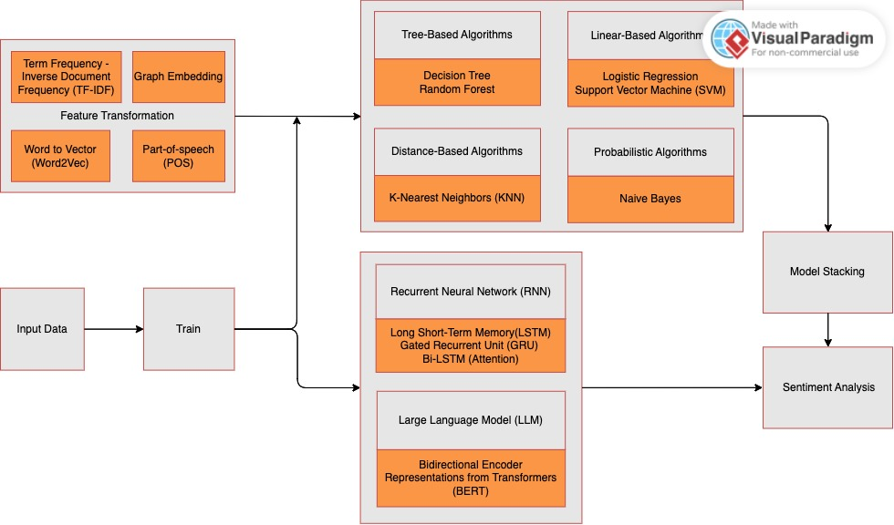

# University & Course Details
- Course: CDS 595 - Natural Language Processing
- University: Worcester Polytechnic Institute
- Semester: Spring 2024

# 🍕 Pizza Sentiments: Decoding Customer Emotions in YELP Reviews

Welcome to the "Pizza Sentiments" project! This repository is dedicated to exploring customer sentiment in YELP reviews specifically focused on pizza establishments. Our goal is to uncover the factors contributing to positive or negative feedback and provide actionable insights for pizza businesses looking to improve customer satisfaction and gain a competitive edge.

## 🌟 Project Overview

Customer reviews on YELP offer a treasure trove of information for businesses seeking to understand their customers better. In this project, we analyzed pizza-related reviews to identify trends, patterns, and key factors that shape customer sentiment. Using a combination of traditional machine learning, deep learning, and large language models, we aimed to decode the emotions and opinions within these reviews.

## 📂 Repository Contents

- **[Presentation](./Presentation.pdf)**: An overview of the project's key findings, presented in a concise and visually appealing format.
- **[Final Report](./Report.pdf)**: A comprehensive report detailing the project's methodology, analysis, and results.
- **[Sentiment Analysis (Python)](./SentimentAnalysis.ipynb)**: A Jupyter notebook showcasing the code and process for sentiment analysis.
- **[Methodology Overview](./Methodology.pdf)**: A detailed explanation of the project's methodology, including feature extraction and model development.
- **[Methodology Flowchart](./Methodology.jpg)**: A visual representation of the sentiment analysis workflow, from preprocessing to model training.
- **[Model Report (PDF)](./Model_Report.pdf)**: A report outlining the performance of different machine learning and deep learning models.
- **[Model Report (Excel)](./Model_Report.xlsx)**: An Excel file containing model performance metrics for easy reference and analysis.

  

## 🔍 Data Description

The dataset used in this project is sourced from YELP and contains pizza-related reviews. It includes various attributes, such as review text, numerical ratings, business information, reviewer information, and review dates. This diverse dataset provides a solid foundation for sentiment analysis, allowing us to extract meaningful insights from customer feedback.

## 🧠 Machine Learning & Deep Learning Approaches

Our methodology involved multiple machine learning and deep learning techniques, including:
- **Feature Extraction**: Using TF-IDF, Word2Vec, POS Tagging, and Graph-based learning to convert raw text into analyzable features.
- **Machine Learning Models**: Utilizing Decision Trees, Random Forests, Logistic Regression, Support Vector Machines (SVM), K-nearest neighbors (KNN), and Naive Bayes for sentiment classification.
- **Deep Learning Models**: Implementing BERT, LSTM, GRU, Bi-LSTM with attention, and other advanced architectures to capture complex text patterns.

## ⚠️ Challenges and Limitations

While the YELP dataset provides valuable insights, it also poses several challenges, such as data inconsistencies, subjectivity in reviews, and model limitations. Addressing these challenges requires careful data preprocessing and robust model training techniques to ensure accurate sentiment analysis.

## 📅 Future Work

To expand this project's scope, future work can explore:
- Aspect-Based Sentiment Analysis
- Advanced Sentiment Detection Techniques
- Temporal Analysis of Sentiment Trends
- Model Ensemble for Sentiment Analysis
- Combining Different Feature Engineering Methods

## 👏 Contributing

We welcome contributions! If you have ideas for improving sentiment analysis or want to add new features, please submit a pull request with your suggestions.

Thank you for exploring our project! We hope you find the insights useful for enhancing pizza businesses and improving customer satisfaction. Enjoy exploring! 🍕
